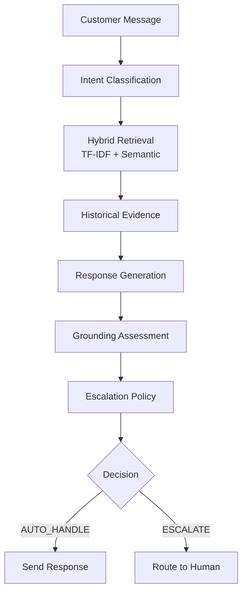

# Hiver AI Support Agent

## 1. Problem
Customer support organizations face extremely high volumes of repetitive inquiries. Automating the initial triage and response stages can significantly reduce operational costs while improving customer response times. 

This project implements an end-to-end AI Customer Support Agent that:
1. Classifies customer intent from natural language.
2. Retrieves historically similar support conversations from past interactions.
3. Generates a historically grounded response based on successful past resolutions.
4. Makes an operational decision to either `AUTO_HANDLE` the ticket or `ESCALATE` it to a human agent based on strict policy thresholds.

## 2. Architecture



The system is powered by a **FastAPI** backend that orchestrates the AI components, and a **React + TypeScript + Vite** frontend that provides a professional engineering dashboard to monitor and test the pipeline.

## 3. Dataset
**Dataset**: Customer Support on Twitter  
**Brand**: AmazonHelp

AmazonHelp was selected because it represents a high-volume, real-world customer support environment with comprehensive coverage of both generic complaints and specific delivery/order issues. The brand's historical responses are high-quality and highly structured, making them excellent candidates for an evidence-based retrieval corpus.

*Note: Due to licensing and size constraints, the raw Kaggle dataset is not committed to this repository. See `data/README.md` for instructions on reconstructing the corpus.*

## 4. Intent Taxonomy
The model classifies incoming queries into one of 9 intents:
1. `DELIVERY_SHIPPING`
2. `PRIME_SUBSCRIPTION`
3. `REFUND_RETURN`
4. `DAMAGED_MISSING_ITEM`
5. `PAYMENT_BILLING`
6. `ACCOUNT_LOGIN`
7. `ORDER_MODIFICATION`
8. `CUSTOMER_SERVICE_COMPLAINT`
9. `OTHER`

Some intents (like `ACCOUNT_LOGIN` or `ORDER_MODIFICATION`) have high operational **difficulty** and require immediate access to user state. Short messages often lack sufficient details, triggering a `needs_context` flag during processing.

## 5. Evaluation Methodology
The system is evaluated against a **200-example AI-assisted stratified evaluation set**.
- **Leakage-safe**: The evaluation conversations are completely excluded from the training pool and the retrieval corpus to prevent data leakage.
- **AI-Assisted Labels**: Note that the evaluation set utilizes AI-assisted labels; these are **NOT** human-validated labels. 
- **Weak Supervision**: The training set relies on weak supervision (heuristics and regex) to generate the initial labels for the TF-IDF baselines.

## 6. Baselines
Two baselines are established to measure final agent performance:
1. **Majority Baseline**: Predicts the most frequent class (`DELIVERY_SHIPPING`).
2. **TF-IDF + Logistic Regression**: A traditional NLP approach trained on the weakly supervised training pool.

*Limitation: Because the training pool is weakly supervised, the baseline may overfit to the heuristics rather than learning deep semantic meaning.*

## 7. Retrieval
The system uses a **Hybrid Retriever** that combines:
- **TF-IDF Retrieval**: Lexical matching to find exact keywords or order tracking numbers.
- **Semantic Retrieval**: Uses `all-MiniLM-L6-v2` to embed queries and fetch conceptually similar historical conversations.

These are combined into a final Hybrid score. 
*Retrieval Metrics*:
- Intent Match @1: 43.5%
- Intent Match @5: 73.0%
- Average Similarity: 0.410
*(Note: Intent-match is used as a proxy metric to gauge if retrieved examples discuss the same issue).*

## 8. Response Generation
The Response Generator uses an LLM that ingests:
- The `customer message`
- Previous conversation `context`
- The predicted `intent`
- Up to 5 `historical customer examples` and their `historical brand responses`

The LLM is prompted to draft a reply mimicking the brand's style based on the retrieved evidence. It also returns a **Grounding Assessment**:
- **STRONG**: Response directly uses retrieved facts.
- **MODERATE**: Response is conceptually similar to retrieved examples.
- **WEAK**: Response ignores retrieval and relies on generic knowledge.
- **NONE**: No retrieval evidence was provided.

## 9. Escalation
A deterministic **Escalation Policy** makes the final operational routing decision.
Escalation to a human is heavily favored when:
- The intent requires account-specific actions (`ACCOUNT_LOGIN`, `ORDER_MODIFICATION`).
- The system flags `needs_context` due to missing tracking numbers or short messages.
- The intent classification `confidence` is too low.
- The generation `grounding` is WEAK or NONE.
- A serious `CUSTOMER_SERVICE_COMPLAINT` is detected.

## 10. Evaluation Results
*Note: Results are evaluated on the AI-assisted evaluation set. See Limitations.*

| Model | Accuracy | Macro F1 | Weighted F1 |
|---|---:|---:|---:|
| Majority Baseline | 12.5% | 2.5% | 2.8% |
| TF-IDF + LogReg | 86.0% | 86.3% | 86.0% |
| Final Agent | 85.5% | 86.0% | 85.6% |

## 11. Failure Analysis
The top five actual failure modes observed in the pipeline:
1. **Weak Retrieval (No Grounding)**: The hybrid retriever could not find historically similar examples above the threshold. *Proposed Improvement: Increase the size of the historical corpus.*
2. **Intent Misclassification**: The weakly supervised model failed to predict the gold intent due to overlapping vocabulary. *Proposed Improvement: Gather manually annotated training data.*
3. **Conservative Complaint Escalation**: Policy explicitly hard-escalates all serious complaints regardless of confidence. *Proposed Improvement: Allow an empathetic de-escalation reply before routing.*
4. **Unsupported Action Escalation**: User requested an action the agent cannot natively perform. *Proposed Improvement: Implement API tool-calling capabilities.*
5. **Over-escalation on Ambiguous Follow-ups**: Short messages escalated aggressively due to missing context. *Proposed Improvement: Build an entity extractor to detect tracking IDs.*

## 12. Demo
### Start the Backend
```bash
python -m uvicorn api.main:app --reload --port 8000
```
*API Documentation available at: [http://localhost:8000/docs](http://localhost:8000/docs)*

### Start the Frontend
```bash
cd frontend
npm install
npm run dev
```
*Dashboard available at: [http://localhost:5173](http://localhost:5173)*

## 13. Project UI
The React frontend functions as an engineering and operations dashboard. Key views include:
- **Overview**: High-level KPIs and metrics.
- **Support Agent**: An interactive live testing console showing the complete AI intelligence pipeline (Intent -> Retrieval -> Generation -> Escalation).
- **Conversations**: Searchable log of evaluation outputs.
- **Evaluation & Analytics**: Visualizations of accuracy distributions, confusion matrices, and escalation rates.
- **Retrieval & System**: Deep-dives into retrieval performance and backend configurations.

## 14. Testing
- **Backend Tests**: 
  ```bash
  pytest
  ```
  *(17 tests passed)*
- **Frontend Build**:
  ```bash
  cd frontend
  npm run build
  ```

## 15. Limitations
- **Evaluation Labels**: The evaluation set uses AI-assisted labeling, which carries inherent bias. It is not human-validated.
- **Weak Supervision**: The TF-IDF baselines were trained using noisy heuristics.
- **Proxy Metrics**: Retrieval performance is measured using intent-match, which is an imperfect proxy metric.
- **No Production Integration**: The agent cannot actually lookup real-time customer orders or modify accounts.
- **Conservative Escalation**: The escalation policy yields a ~96% escalation rate due to strict safety thresholds on short social-media queries.

## 16. Future Improvements
- Construct a fully human-validated evaluation set.
- Implement stronger cross-encoder reranking for retrieval.
- Integrate production monitoring and a human-in-the-loop feedback system.
- Expand the semantic retrieval corpus beyond 30,000 tweets.
