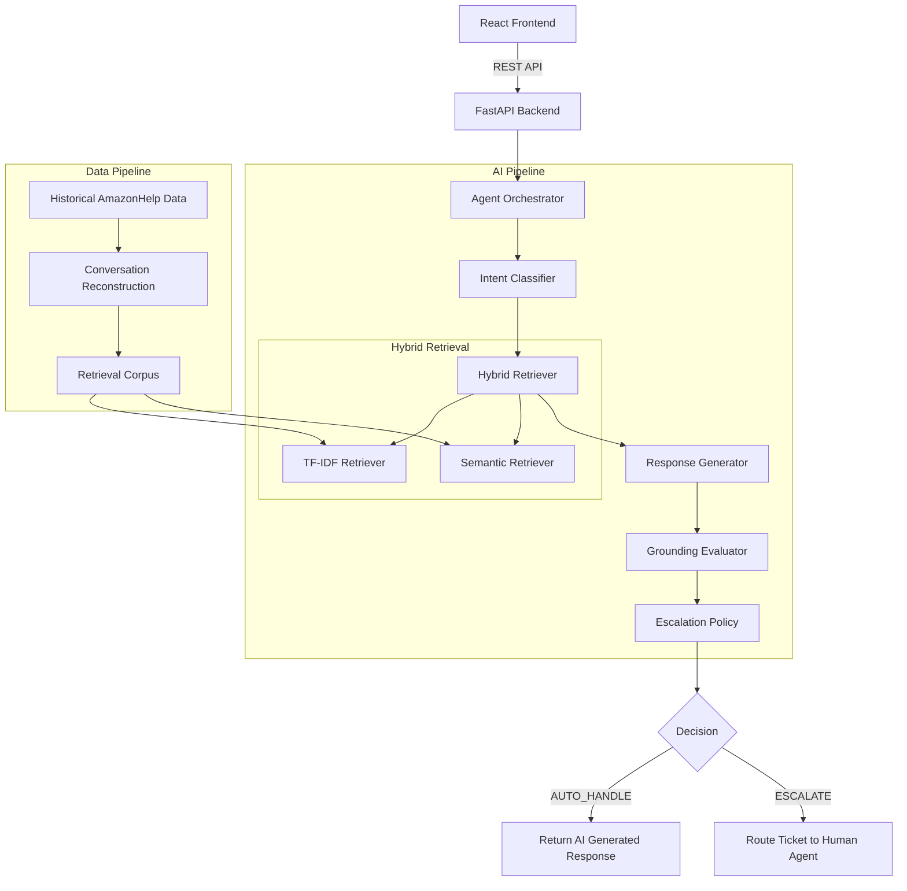

# Hiver AI Support Agent - Architecture

This document visualizes the complete system architecture for the Hiver AI Customer Support Agent pipeline.

## System Architecture

## Component Details
1. **React Frontend**: An engineering operations dashboard to visualize metrics and test the pipeline live.
2. **FastAPI Backend**: Provides REST endpoints (`/api/agent/run`, `/api/evaluation/summary`) to serve the pipeline.
3. **Intent Classifier**: Scikit-Learn Logistic Regression model trained via weak supervision on historical customer queries.
4. **Hybrid Retriever**: Combines TF-IDF lexical search and `all-MiniLM-L6-v2` semantic search to fetch relevant historical solutions.
5. **Response Generator**: LLM generation pipeline that drafts a response based on the retrieved evidence.
6. **Grounding Evaluator**: Assesses the generated response against retrieved facts (STRONG, MODERATE, WEAK, NONE).
7. **Escalation Policy**: A deterministic routing rule engine that hard-escalates uncertain or sensitive queries based on thresholds.
